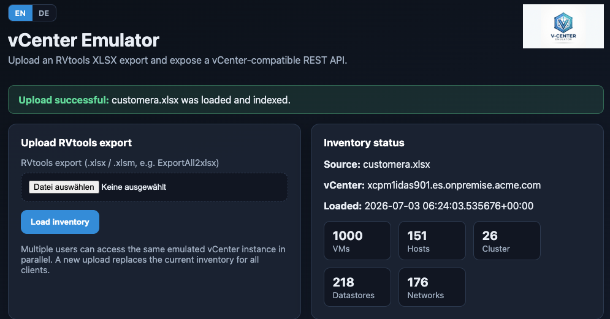

# vCenter Emulator

Emulates a **VMware vCenter REST API** based on an **RVtools XLSX export**. The application runs on **RHEL 10**, provides a web interface for uploads, and serves multiple concurrent API clients.



## Features

- Web UI for uploading RVtools files (`ExportAll2xlsx` or individual tabs)
- Parses the tabs `vInfo`, `vHost`, `vCluster`, `vDatastore`, `vNetwork`, `vDisk`, `vSource`
- vCenter-compatible REST endpoints under `/rest`
- Session authentication like vCenter (`vmware-api-session-id`)
- **Simulated write operations**: Power On/Off/Suspend/Reset, maintenance mode, annotation
- **Additional endpoints**: resource pools, folders, guest identity/networking
- Concurrent access via async FastAPI + optional multiple Uvicorn workers
- **TLS via nginx** (self-signed or custom certificate)
- **OpenShift 4** deployment with Route, PVC, and UBI-based container image

## Quick Start (Development)

### macOS / Cursor

```bash
bash scripts/dev-mac.sh
```

Then open **http://127.0.0.1:8443/** in your browser. If `customer.xlsx` is in the project root, it is loaded automatically via `.env`.

In Cursor:
- **Run and Debug** → `vCenter Emulator: Dev Server`
- **Terminal → Run Task** → `dev: setup + start (Mac)` or `dev: smoke test`

Smoke test (server must be running):

```bash
bash scripts/smoke-test-mac.sh
```

Copy `.env.example` to `.env` to customize local settings.

### Manual setup

```bash
python3 -m venv .venv
source .venv/bin/activate
pip install -r requirements.txt
pip install -e .
export VCENTEREMU_UPLOAD_DIR=./uploads
mkdir -p uploads
uvicorn app.main:app --host 0.0.0.0 --port 8443 --reload
```

Web UI: `http://localhost:8443/`

## Download, install, and run on RHEL 10

This section describes how to deploy the emulator on a fresh **Red Hat Enterprise Linux 10** server.

### Requirements

- RHEL 10 (or compatible Enterprise Linux) with `sudo` access
- Network access to install packages via `dnf`
- An RVtools XLSX export (e.g. `ExportAll2xlsx`) from your vSphere environment
- Optional: registered DNS name and open firewall ports for remote access

### 1. Download

Clone the repository or copy the release archive to the server:

```bash
sudo dnf install -y git
git clone https://github.com/alfbach/vcenteremu.git
cd vcenteremu
```

Alternatively, upload a ZIP/tarball of the project and extract it:

```bash
cd vcenteremu
```

### 2. Install

Run the install script as **root**. It installs all OS prerequisites, creates a Python virtual environment, deploys the application to `/opt/vcenteremu`, and registers a **systemd** service.

**Standard installation (HTTP on port 8443):**

```bash
sudo bash deploy/install.sh
```

**Production installation with HTTPS and firewall rules:**

```bash
sudo bash deploy/install.sh \
  --with-tls \
  --with-firewall \
  --hostname vcenteremu.example.com
```

The installer automatically sets up:

| Component | Location / name |
|---|---|
| Application | `/opt/vcenteremu` |
| Upload storage | `/var/lib/vcenteremu/uploads` |
| Configuration | `/etc/vcenteremu/vcenteremu.env` |
| Logs | `/var/log/vcenteremu/` |
| systemd service | `vcenteremu.service` |
| Control script | `vcenteremu-ctl` |

Installed packages include `python3`, `python3-pip`, `python3-devel`, `gcc`, `gcc-c++`, `make`, `openssl`, `curl`, `rsync`, and `systemd`.

### 3. Configure (optional)

Edit `/etc/vcenteremu/vcenteremu.env` before or after installation:

```env
VCENTEREMU_API_USERNAME=administrator@vsphere.local
VCENTEREMU_API_PASSWORD=Emulator123!
VCENTEREMU_VCENTER_NAME=vcenteremu.example.com
VCENTEREMU_HOST=0.0.0.0
VCENTEREMU_PORT=8443
VCENTEREMU_WORKERS=4
VCENTEREMU_MAX_UPLOAD_MB=512
```

Change the default password before exposing the service to a network.

Apply changes:

```bash
sudo systemctl restart vcenteremu
```

### 4. Run and verify

Check that the service is running:

```bash
sudo systemctl status vcenteremu
sudo systemctl enable vcenteremu
```

Open the web UI in a browser:

| Mode | URL |
|---|---|
| HTTP (default) | `http://<server-fqdn>:8443/` |
| HTTPS (with `--with-tls`) | `https://<server-fqdn>/` |

**First steps in the UI:**

1. Open the web interface (see screenshot above).
2. Choose **EN** or **DE** for the interface language.
3. Upload your RVtools `.xlsx` file under **Upload RVtools export**.
4. Review inventory statistics and API credentials on the dashboard.

Quick health check from the server:

```bash
curl -s http://127.0.0.1:8443/health
```

API smoke test:

```bash
TOKEN=$(curl -sk -u 'administrator@vsphere.local:Emulator123!' \
  -X POST 'http://127.0.0.1:8443/rest/com/vmware/cis/session')
curl -sk -H "vmware-api-session-id: ${TOKEN}" \
  'http://127.0.0.1:8443/rest/vcenter/vm' | head
```

Service management:

```bash
sudo systemctl restart vcenteremu
sudo journalctl -u vcenteremu -f

# or manually without systemd:
sudo vcenteremu-ctl start|stop|restart|status
sudo vcenteremu-ctl foreground   # foreground / debugging
```

Alternative install wrapper: `sudo bash deploy/install-rhel10.sh`

### TLS with nginx (optional, recommended for production)

If you did not use `--with-tls` during installation:

```bash
sudo bash deploy/install-nginx-tls.sh vcenteremu.example.com
```

- nginx listens on **443** (HTTPS)
- Backend runs internally on **127.0.0.1:8080**
- Self-signed certificate: `/etc/vcenteremu/tls/`
- Replace with your own CA: place `cert.pem` and `key.pem` in that directory and run `sudo systemctl restart nginx`

## Install on OpenShift 4

Deploy the emulator as a containerized application on **Red Hat OpenShift Container Platform 4** with HTTPS via an OpenShift **Route**, persistent upload storage, and a **UBI 9**-based image.


### Requirements

- OpenShift 4.x cluster with cluster-admin or project-admin access
- OpenShift CLI (`oc`) installed and logged in: `oc login`
- A dynamic storage provisioner (for the upload PVC)
- Permission to create Builds and Routes in the target project
- An RVtools XLSX export for upload via the web UI

### Architecture on OpenShift

| Component | Description |
|---|---|
| `Dockerfile` | UBI 9 Python 3.11 image, non-root (UID 1001), port **8080** |
| `Deployment` | Single replica (in-memory inventory); `Recreate` strategy |
| `PVC` | 5 GiB volume for uploaded XLSX files |
| `Route` | HTTPS edge termination (redirects HTTP → HTTPS) |
| `ConfigMap` / `Secret` | Application settings and API password |
| `BuildConfig` | Optional image build from Git or local source |

Manifests are located in `deploy/openshift/`.

### Option A — Automated install (recommended)

From the project root, on a workstation with `oc` access:

```bash
chmod +x deploy/openshift/install-openshift.sh
./deploy/openshift/install-openshift.sh \
  --namespace vcenteremu \
  --hostname vcenteremu.apps.cluster.example.com
```

The script will:

1. Create the namespace `vcenteremu`
2. Create a Secret with your API password (interactive prompt)
3. Apply ConfigMap, PVC, Service, and Route
4. Build the container image via OpenShift BuildConfig
5. Deploy the application and wait for rollout

After completion, open the Route URL shown in the output, e.g. `https://vcenteremu.apps.cluster.example.com/`.

Build from a pre-pushed image instead:

```bash
./deploy/openshift/install-openshift.sh \
  --namespace vcenteremu \
  --from-image quay.io/your-org/vcenteremu:latest \
  --password 'YourSecurePassword'
```

### Option B — Manual install

**1. Log in and create project**

```bash
oc login --token=<token> --server=https://api.cluster.example.com:6443
oc new-project vcenteremu
```

**2. Create secret and configuration**

```bash
oc create secret generic vcenteremu-secret \
  --from-literal=VCENTEREMU_API_PASSWORD='YourSecurePassword'

oc apply -f deploy/openshift/configmap.yaml
oc patch configmap vcenteremu-config \
  --type merge -p '{"data":{"VCENTEREMU_VCENTER_NAME":"vcenteremu.apps.cluster.example.com"}}'
```

**3. Build the image**

From Git (cluster must reach GitHub):

```bash
oc apply -f deploy/openshift/buildconfig.yaml
oc start-build vcenteremu --wait
```

Or build locally and push to your registry:

```bash
podman build -t quay.io/your-org/vcenteremu:latest .
podman push quay.io/your-org/vcenteremu:latest
```

**4. Deploy workload**

```bash
oc apply -f deploy/openshift/pvc.yaml
oc apply -f deploy/openshift/deployment.yaml
oc apply -f deploy/openshift/service.yaml
oc apply -f deploy/openshift/route.yaml

# if using an external image:
oc set image deployment/vcenteremu vcenteremu=quay.io/your-org/vcenteremu:latest
```

**5. Verify**

```bash
oc get pods,route -n vcenteremu
oc logs -f deployment/vcenteremu

ROUTE=$(oc get route vcenteremu -o jsonpath='{.spec.host}')
curl -sk "https://${ROUTE}/health"
```

### Option C — Kustomize

```bash
oc apply -k deploy/openshift/
oc create secret generic vcenteremu-secret \
  --from-literal=VCENTEREMU_API_PASSWORD='YourSecurePassword' \
  -n vcenteremu
oc set image deployment/vcenteremu \
  vcenteremu=image-registry.openshift-image-registry.svc:5000/vcenteremu/vcenteremu:latest \
  -n vcenteremu
```

### Using the application on OpenShift

1. Open the Route URL in your browser.
2. Select **EN** or **DE** for the UI language.
3. Upload your RVtools `.xlsx` file (stored on the PVC).
4. Use the displayed API credentials and `/rest/` endpoints.

Example API call via Route:

```bash
ROUTE=$(oc get route vcenteremu -o jsonpath='{.spec.host}')
TOKEN=$(curl -sk -u 'administrator@vsphere.local:YourSecurePassword' \
  -X POST "https://${ROUTE}/rest/com/vmware/cis/session")
curl -sk -H "vmware-api-session-id: ${TOKEN}" \
  "https://${ROUTE}/rest/vcenter/vm" | head
```

### Operations

```bash
# Scale (keep at 1 replica — inventory is in-memory per pod)
oc scale deployment/vcenteremu --replicas=1

# Restart after ConfigMap change
oc rollout restart deployment/vcenteremu

# View logs
oc logs -f deployment/vcenteremu

# Delete everything
oc delete project vcenteremu
```

### OpenShift notes

- **Single replica recommended** — each pod holds its own in-memory inventory; use one replica or accept inconsistent state across pods.
- **Upload limit** — default 512 MiB (`VCENTEREMU_MAX_UPLOAD_MB` in ConfigMap).
- **TLS** — handled by the OpenShift Route (edge termination); no nginx required inside the cluster.
- **Restricted SCC** — the image runs as non-root UID 1001 and is compatible with the default restricted Security Context Constraint.

## API Usage

1. Create a session:

```bash
curl -sk -u 'administrator@vsphere.local:Emulator123!' \
  -X POST 'https://vcenteremu.local/rest/com/vmware/cis/session'
```

2. Query inventory:

```bash
curl -sk -H 'vmware-api-session-id: <token>' \
  'https://vcenteremu.local/rest/vcenter/vm'
```

3. Power on a VM (simulated — only changes the emulated power state):

```bash
curl -sk -H 'vmware-api-session-id: <token>' \
  -X POST 'https://vcenteremu.local/rest/vcenter/vm/vm-web-01/power/start'
```

4. Put a host into maintenance mode (simulated):

```bash
curl -sk -H 'vmware-api-session-id: <token>' \
  -X POST 'https://vcenteremu.local/rest/vcenter/host/host-esxi-01/maintenance/enter'
```

See the web UI at `/` for additional endpoints.

## Notes

- This is an **emulator**, not a full vCenter replacement. Write operations only change in-memory state.
- A new upload replaces the inventory; simulated changes are lost in the process.
- For production: use TLS, strong passwords, and a proper CA certificate if applicable.

## Tests

```bash
pip install pytest httpx
pytest -q
```

## License

This project is licensed under the **GNU General Public License Version 2 (GPL-2.0)**.

You may use, modify, and distribute this software under the terms of the GPL-2.0. If you distribute it, you must provide the source code (or complete corresponding source) and include the license.

Full license text: https://www.gnu.org/licenses/old-licenses/gpl-2.0.html

## Disclaimer

This software is provided **“as is”**, without warranty of any kind. **No guarantee** is made regarding accuracy, completeness, availability, or fitness for a particular purpose.

Use is at **your own risk**. The authors and contributors shall not be liable for any direct or indirect damages, data loss, downtime, misconfiguration, or other adverse consequences arising from the use or inability to use this software, to the extent permitted by applicable law.

This project is an **unofficial emulator** and is not affiliated with VMware or Broadcom. VMware, vCenter, vSphere, and RVtools are trademarks or products of their respective owners.
